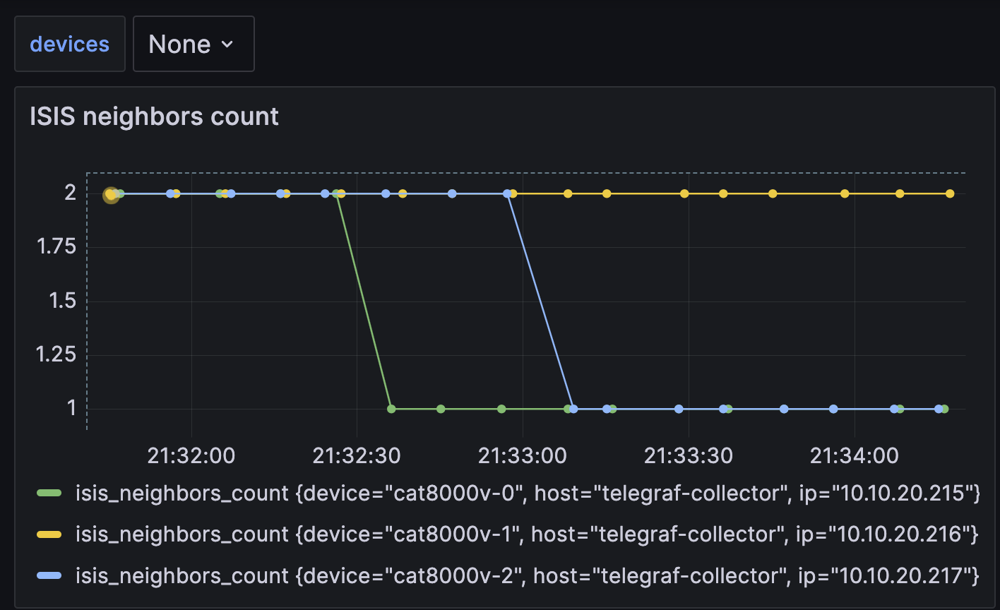
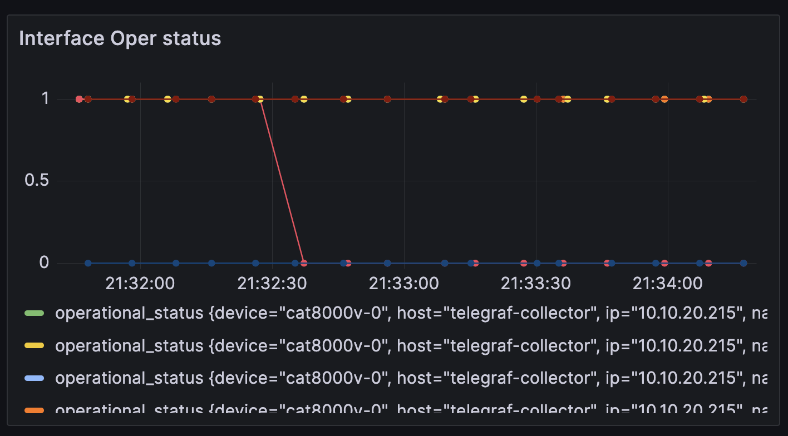
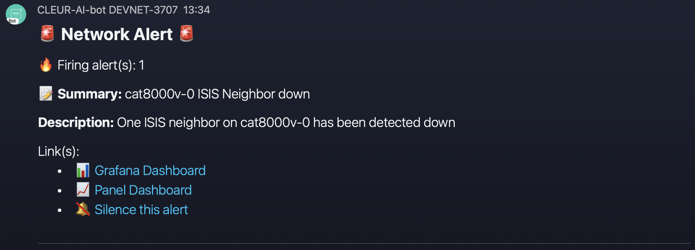
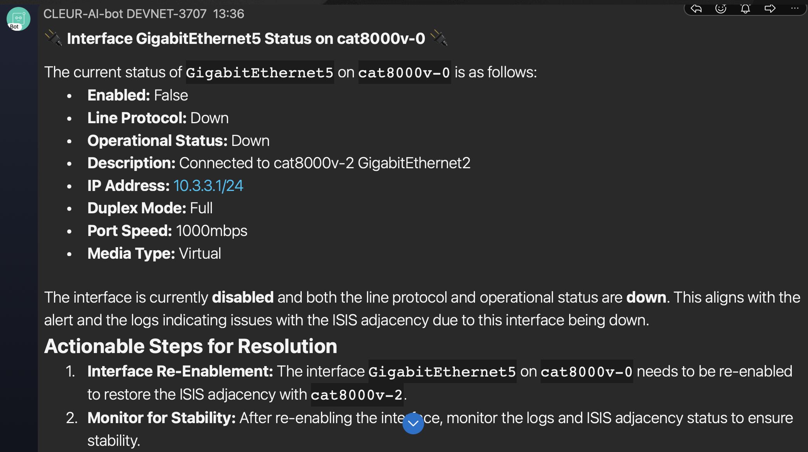
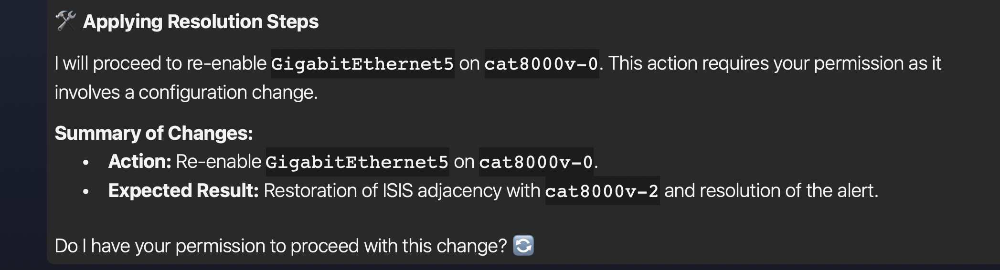
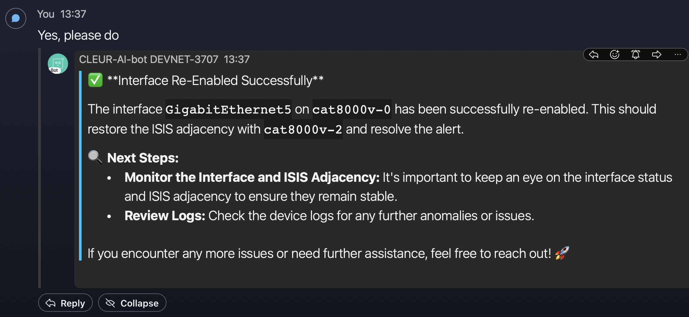
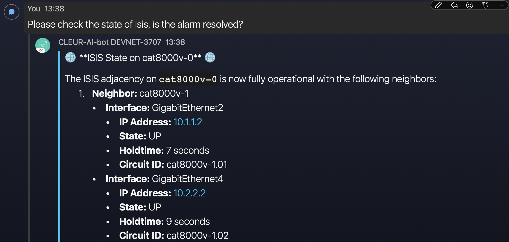
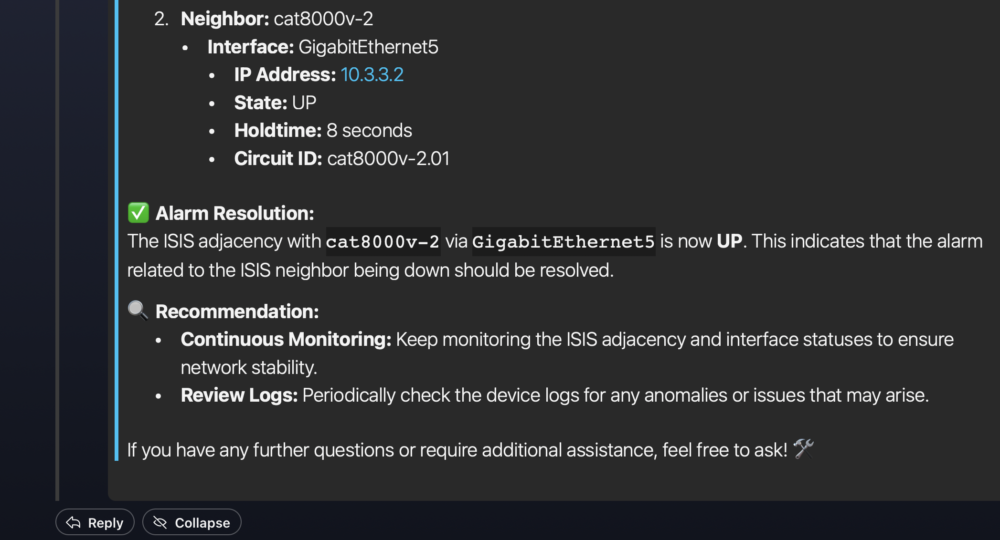

# 🦾 CLEUR DevNet-3707 2024

🎥 Slides and recording [are available here](https://www.ciscolive.com/on-demand/on-demand-library.html?#/session/1707505627331001pilj)

This demo is built to showcase how you AI might assist you in troubleshooting network issues.

The components used by this demo are:

- Virtual IOS-XE devices running ISIS.
  - The [CML Devnet sandbox](https://developer.cisco.com/site/sandbox/) was used to build the lab.
- [ncpeek.](https://github.com/jillesca/ncpeek) A python netconf client used for telegraf.
- TIG stack with docker 20.10+ 🐳
  - Telegraf grabs telmetry data from network devices.
  - Grafana kicks a webhook when an alarm is detected. 🚨
- FastAPI.
  - Host the LLM.
  - Interacts with network devices & frontend.
- PyATS. Provides a framework to interact with network devices. 🛠️
- [Webex_bot](https://github.com/fbradyirl/webex_bot) use to interact with the LLM. 🤖
- OpenAI LLM. 🧠
  - `gpt-4-turbo-preview` was used. 🚀

## 🎬 Demo

For this demo [one alarm was created.](grafana/alerts.yaml)

When the average number of ISIS neighbors in a lapse of 30 second _**is less than**_ the average number of ISIS neighbors in a lapse of 30 minutes, the alarm will trigger a webhook for the LLM.

This signal that a stable ISIS neighbor that was working on the last 30 minutes was lost, and allows to work with `N` number of ISIS neighbors.

## 🛠️ Prepare Demo

### 🔑 Environment variables

#### 📌 Mandatory variables

For the demo to work, you **must** set the next environment variables. You can either `export` the environment variables or create a `.env` file with them. See [.env.local](.env.local) for an example.

```bash
OPENAI_API_KEY=<YOUR_OPENAI_API_KEY>
WEBEX_TEAMS_ACCESS_TOKEN=<YOUR_TEAM_ACCESS_TOKEN>
WEBEX_APPROVED_USERS_MAIL=<MAILS_OF_USERS_APPROVED_SEPARATED_BY_COMMAS>
WEBEX_USERNAME=<YOUR_WEBEX_USERNAME>
WEBEX_ROOM_ID=<THE_WEBEX_ROOM_ID>
```

> _**NOTE:**_ The webex variables are only needed if you interact with the LLM using webex.

If you prefer to use another client, you need to:

- Modify the [notify function](llm_agent/app.py#L59) to accomodate your client.
- Remove/comment [the start of the webex bot](llm_agent/app.py#L73)
- Communicate with the LLM using REST API. See [send_message_to_chat_api](llm_agent/webex_chat/chat_api_client.py#L13) for an example. 📡

##### 📝 Webex considerations

To get your webex token go to <https://developer.webex.com/docs/bots> and create a bot.

To get the `WEBEX_ROOM_ID` the easiest way is to open a room with your bot in the webex app. Once you have your room, you can get the `WEBEX_ROOM_ID` by using [API list room,](https://developer.webex.com/docs/api/v1/rooms/list-rooms) use your token created before.

#### 📌 Optional Variables

For testing, you can use the `GRAFANA_WEB_HOOK` env var to send webhooks to other site, such as <https://webhook.site/>

If you have access to smith.langchain.com (recommended for view LLM operations) add your project ID and API key.

```bash
GRAFANA_WEB_HOOK=<WEB_HOOK_URL>
LANGCHAIN_PROJECT=<YOUR_LANGCHAIN_PROJECT_ID>
LANGCHAIN_API_KEY=<YOUR_LANGCHAIN_API_KEY>
LANGCHAIN_TRACING_V2=true
LANGCHAIN_ENDPOINT=https://api.smith.langchain.com
```

#### .env.local file

The [.env.local file](.env.local) is used to define all variables used by the containers.

In a production environment, this file should be kept out of version control using the `.gitignore` file.

### 🚀 Start the topology

This demo uses a CML instance from the [Cisco DevNet sandbox](https://developer.cisco.com/site/sandbox/). You can also use a dedicated CML instance or a NSO sandbox. 🏖️

After acquiring your sandbox, stop the default topology and wipe it out. 🧹

Then, import the [topology file](cml/topology.yaml) used for this demo and start the lab.

### 📦 TIG Stack

The TIG stack requires Docker and IP reachability to the CML instance. For this demo, I used my laptop.

To start the TIG stack do.

```bash
./build_run_telegraf.sh
./build_run_influxdb.sh
./build_run_grafana.sh
```

### 🚦 Verifying Telemetry on Telegraf, Influxdb, Grafana

- telegraf
  - Run `docker exec -it telegraf bash` and then [tail -F /tmp/telegraf-grpc.log](telegraf/dockerfile#L30) to see Telegraf logs.
- Influxdb
  - Access <http://localhost:8086> with the credentials admin/admin123
- Grafana
  - Access <http://localhost:3000/dashboards> with the credentials admin/admin
  - Navigrate to `General > Network Telemetry` to see the grafana dashboard.

### 🏁 Starting the LLM

The [llm_agent directory](llm_agent/) provides all the code used to run the LLM.

In this demo, the LLM is run using a Python virtual environment. Ensure that you install the [requirementes listed.](llm_agent/requirements.txt)

The entry point for the application is the [app file](llm_agent/app.py)

> _**NOTE:** In the upcoming weeks, a container will be added for the LLM_

## 🎮 Running the Demo


The demo involves shutting down one interface, causing an ISIS failure, and allowing the LLM to diagnose the issue and implement a fix.

In the images below, `GigabitEthernet5` was shutting down on `cat8000-v0` resulting in losing its ISIS adjacency with `cat8000-v2`

On Grafana, you can observe the ISIS count decreasing and triggering an alarm.




Next, you will receive a webex notification from grafana and the LLM will receive the webhook. The webhook triggers the LLM to start looking at what the issue is and how to resolve it.








## 📝 Notes

- You can easily run out of OpenAI tokens in your replies from netconf, so is important to filter data to what AI could need.
- Repeated alarms are suppresed by Grafana, this is controlled by [the grafana policy file,](grafana/config/policies.yaml)
  - If you are testing continously, run `./build_run_grafana.sh` to destroy and create the container.
  - This isn't an ideal scenario, but a proper solution wasn't found within the given time.
- From time to time, the answers from the LLM are lost and not sent to webex. You can find them on the terminal output.
- This is the second iteration of this exercise. The first one was [presented at Cisco Impact 2023](https://github.com/jillesca/open_telemetry_network_impact)

## 📚 Troubleshooting

If the CML lab is not reachable from your laptop, it's usually due to a connectivity issue between the devices and the CML bridge. Here are some steps to resolve this:

- Try flapping the management interface (G1) of the devices several times.
- Ping from the devices to their Gateway (10.10.20.255).
- Go to the DevBox 10.10.20.50 (credentials: developer/C1sco12345) and ping the management interface of the devices.

Connectivity usually starts to work after about 5 minutes.

In more drastic cases, restart the cat8kv from the CML GUI.
